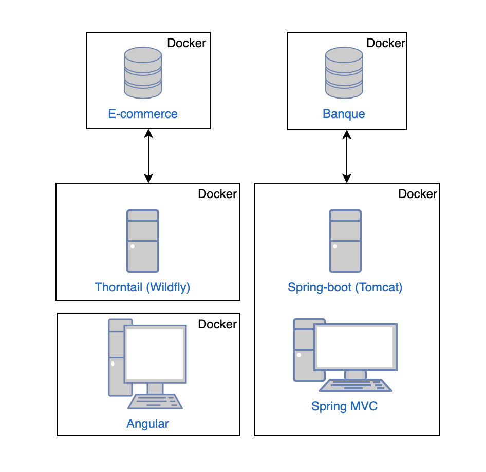

# TP – Nouvelles technologies de la répartition - 2020

L'ensemble de l'application est hébergée dans des containers Docker afin de permettre le déploiement de celle-ci sur n'importe quel poste, à condition bien sûr d'avoir Docker d'installer.

Notre système doit utiliser deux serveurs d'applications différents.

Pour développer l'application de e-commerce : nous avons fait le choix d'utiliser le framework Thorntail, Thorntail est un framework similaire à Spring boot, dans le sens où il est permet d'éxécuter localement un serveur d'application Wildfly avec le code de l'application intégré, on appelle cela un "uber-jar" car le jar porte non seulement l'application mais également le serveur, très pratique pour déployer n'importe où mais plus précisement sur les containes docker.

Cette application d'e-commerce utilisera le framework Angular en front car nous avons eu des difficultés  d'intégrer un framework front dans throntail. 

Pour développer l'application de banque : nous avons fait le choix d'utiliser le framework Spring Boot pour les mêmes raisons que pour le framework Thorntail tout en utilisant un serveur d'application Tomcat, à l'aide de Spring boot nous pouvons facilement intégrer le framework Spring MVC afin de produire des pages.

La base de donnée utilisée est MySQL. MySQL est une base de donnée qu'on ne présente plus, elle est utilisée dans le monde entier.

Architecture de notre application : 

```

```

[^https://thorntail.io/]: Thorntail Framework
[^https://spring.io/projects/spring-boot]: Spring Boot.
[^https://www.docker.com/]: Docker
[^https://angular.io/]: Angular


Pour développer les différents web-services nous avons utilisé le framework Jaxrs et Jaxws qui permettent de développer respectivement des web services REST et SOAP, on peut facilement les intégrer à notre projet à l'aide de maven


    <dependency>
      <groupId>io.thorntail</groupId>
      <artifactId>webservices</artifactId>
    </dependency>
    <dependency>
      <groupId>io.thorntail</groupId>
      <artifactId>jaxrs</artifactId>
    </dependency>
Ici un exemple d'intégration de ces services avec les dépendances liées au framework Thorntail, vous trouverez ensuite l'ensemble de l'implémentation des services dans le projet fourni avec ce rapport


Pour générer les clients des services SOAP, nous sommes passés par un plugin maven 

            <plugin>
                <groupId>org.codehaus.mojo</groupId>
                <artifactId>jaxb2-maven-plugin</artifactId>
                <version>1.6</version>
                <executions>
                    <execution>
                        <id>xjc</id>
                        <goals>
                            <goal>xjc</goal>
                        </goals>
                    </execution>
                </executions>
                <configuration>
                    <schemaDirectory>${project.basedir}/src/main/resources/</schemaDirectory>
                    <outputDirectory>${project.basedir}/src/main/java</outputDirectory>
                    <clearOutputDir>false</clearOutputDir>
                </configuration>
            </plugin>
L'ensemble du code permettant de générer le client est maintenant généré dans le dossier ${project.basedir}/src/main/java.

Architecture fonctionnelle 

Notre projet dispose de deux applications différentes un site de e-commerce et un site bancaire Sur le site de e-commerce un client peut vendre des objets et/ou en acheter, dans les deux cas il doit renseigner son numéro de carte bleue c'est ce numéro qui pourra faire le lien avec le site de banque, ce numéro de carte bleue sera utilisée aussi bien pour le remboursement que pour le débit.


